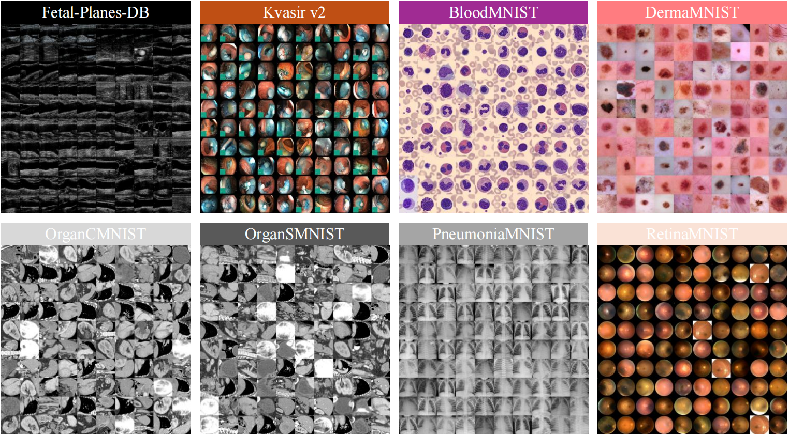

[//]: # (# MedCTM)
<p align="center">
  
</p>

--- 
Official PyTorch implementation of "[**MedCTM: A CNN-Transformer-Mamba Hybrid Network for Medical Image Classification**]".

> **Abstract:** Medical image classification is crucial for computer-aided diagnosis, while existing methods face challenges in jointly modeling local texture, global dependencies, and long-range contextual relationships. Specifically, CNNs typically lack long-range feature capture capability, while Transformers rely on a large amount of labeled data and are computationally expensive. Furthermore, existing hybrid architectures usually suffer from inefficient feature interaction and computational redundancy. To address these problems, in this study, we propose a novel CNN-Transformer-Mamba ternary collaborative architecture named MedCTM networks. The network synergizes convolutional local feature extraction, Transformer-based bidirectional cross-attention, and Mamba for linear complexity long sequence modeling. Firstly, a bidirectional channel interaction attention mechanism dynamically fuses CNN-captured local details with Mamba-modeled global spatial dependencies. Secondly, a lightweight three-tier cascade architecture  is designed to progressively refine multi-scale features. Comprehensive experiments based on eight medical image benchmark datasets demonstrate that MedCTM achieves remarkable state-of-the-art performance and superior computational efficiency.

<div align="center">
  
</div>

> The overall architecture of MedCTM.


# Installation
* `pip install torch==2.1.2 torchvision==0.16.2 torchaudio`
* `pip install packaging==23.0`
* `pip install timm==0.9.16`
* `pip install pytest==8.3.5 chardet==4.0.0 yacs==0.1.8 termcolor==2.4.0`
* `pip install triton==2.1.0`
* `pip install causal-conv1d==1.0.1`
* `pip install mamba-ssm==1.0.1`
* `pip install scikit-learn==1.3.2 matplotlib==3.7.1`
* `pip install SimpleITK`
* `pip install scikit-image`
* `pip install PyWavelets==1.4.1`
------
# The classification performance of MedCTM
Since MedCTM is suitable for most medical images, you can try applying it to advanced tasks (such as ***multi-label classification***, ***medical image segmentation***, and ***medical object detection***). In addition, we are testing MedCTM with different parameter sizes.

<div align="center">
  
</div>

<div align="center">

| Dataset | Task | F1-score | AUC | Kappa |
|:------:|:--------:|:----------:|:----------:|:----------:|
| **[Fetal-Planes-DB](https://zenodo.org/records/3904280)** | Multi-Class (4) | **88.8 / 90.1** | **98.8 / 98.9** | **87.8 / 88.7** |
| **[Kvasir](https://datasets.simula.no/kvasir/)** | Multi-Class (8) | **88.6 / 88.7** | **99.3 / 99.2** | **86.9 / 87.1** |
| **[BloodMNIST](https://medmnist.com/)** | Multi-Class (8) | **98.1 / 98.9** | **99.9 / 100.0** | **98.0 / 98.6** |
| **[DermaMNIST](https://medmnist.com/)** | Multi-Class (7) | **66.4 / 67.2** | **95.9 / 95.4** | **65.3 / 65.8** |
| **[OrganCMNIST](https://medmnist.com/)** | Multi-Class (11) | **89.0 / 89.9** | **99.3 / 99.5** | **87.8 / 89.4** |
| **[OrganSMNIST](https://medmnist.com/)** | Multi-Class (11) | **74.9 / 75.9** | **97.7 / 97.9** | **76.5 / 76.9** |
| **[PneumoniaMNIST](https://medmnist.com/)** | Binary-Class (2) | **92.8 / 95.1** | **99.1 / 98.9** | **85.6 / 90.1** |
| **[RetinaMNIST](https://medmnist.com/)** | Multi-Class (5) | **42.4 / 43.5** | **74.0 / 75.7** | **37.5 / 37.5** |

</div>

> On the left is the Tiny version, and on the right is the Large version.
### 📌The next step will be to make the weights public.

# Results visualization

<div align="center">
  
</div>

> Heatmaps for visualization based on Grad-CAM. The visualized layers are all from the last layer before entering the classification head.
<div align="center">
  
</div>

> t-SNE results for MedCTM and other models.
# Downstream Results
## Object Detection and Instant Segmentation Results
### Object Detection  and Instant Segmentation Performance Based on [Mask-RCNN](https://openaccess.thecvf.com/content_ICCV_2017/papers/He_Mask_R-CNN_ICCV_2017_paper.pdf) for [COCO2017](https://cocodataset.org):
| Backbone | AP<sup>b</sup> | AP<sup>b</sup><sub>50</sub> | AP<sup>b</sup><sub>75</sub> | AP<sup>b</sup><sub>S</sub> | AP<sup>b</sup><sub>M</sub> | AP<sup>b</sup><sub>L</sub> | AP<sup>m</sup> | AP<sup>m</sup><sub>50</sub> | AP<sup>m</sup><sub>75</sub> | AP<sup>m</sup><sub>S</sub> | AP<sup>m</sup><sub>M</sub> | AP<sup>m</sup><sub>L</sub> | #Params | FLOPs |                    Cfg                     |                    Log                     |                    Model                     |
|:--------:|:--------------:|:---------------------------:|:---------------------------:|:--------------------------:|:--------------------------:|:--------------------------:|:--------------:|:---------------------------:|:---------------------------:|:--------------------------:|:--------------------------:|:--------------------------:|:-------:|:-----:|:------------------------------------------:|:------------------------------------------:|:--------------------------------------------:|
|  MobileMamba-B1  |      40.6      |            61.8             |            43.8             |            22.4            |            43.5            |            55.9            |      37.4      |            58.9             |            39.9             |            17.1            |            39.9            |            56.4            |  38.0M  | 178G  | [cfg](downstream/det/configs/mask_rcnn/mask-rcnn_mobilemamba_b1_fpn_1x_coco.py) | [log](weights/downstream/det/maskrcnn.log) | [model](https://drive.google.com/file/d/1vxp7cV2YXxu2GJmIgoAYE7bARve9qlBp/view?usp=drive_link) |

### Object Detection Performance Based on [RetinaNet](https://openaccess.thecvf.com/content_ICCV_2017/papers/Lin_Focal_Loss_for_ICCV_2017_paper.pdf) for [COCO2017](https://cocodataset.org):
| Backbone |  AP  | AP<sub>50</sub> | AP<sub>75</sub> | AP<sub>S</sub> | AP<sub>M</sub> | AP<sub>L</sub> | #Params | FLOPs |                     Cfg                     |                     Log                     |                     Model                     |
|:--------:|:----:|:---------------:|:---------------:|:--------------:|:--------------:|:--------------:|:-------:|:-----:|:-------------------------------------------:|:-------------------------------------------:|:---------------------------------------------:|
|  MobileMamba-B1  | 39.6 |      59.8       |      42.4       |      21.5      |      43.4      |      53.9      |  27.1M  | 151G  | [cfg](downstream/det/configs/retinanet/retinanet_mobilemamba_b1_fpn_1x_coco.py) | [log](weights/downstream/det/retinanet.log) | [model](https://drive.google.com/file/d/1uQzA-k721hacqnORf5WPlYFK9rAxauDC/view?usp=drive_link) |

### Object Detection Performance Based on [SSDLite](https://openaccess.thecvf.com/content_ICCV_2019/papers/Howard_Searching_for_MobileNetV3_ICCV_2019_paper.pdf) for [COCO2017](https://cocodataset.org):
|      Backbone       |  AP  | AP<sub>50</sub> | AP<sub>75</sub> | AP<sub>S</sub> | AP<sub>M</sub> | AP<sub>L</sub> | #Params | FLOPs |                                      Cfg                                      |              Log               |                      Model                      |
|:-------------------:|:----:|:---------------:|:---------------:|:--------------:|:--------------:|:--------------:|:-------:|:-----:|:-----------------------------------------------------------------------------:|:------------------------------:|:-----------------------------------------------:|
|   MobileMamba-B1    | 24.0 |      39.5       |      24.0       |      3.1       |      23.4      |      46.9      |  18.0M  | 1.7G  |   [cfg](downstream/det/configs/ssd/ssdlite_mobilemamba_b1_8gpu_2lr_coco.py)   |   [log](weights/downstream/det/ssdlite.log)   |   [model](https://drive.google.com/file/d/1EUuCJMqJlOkE3sQlLA0n04YPW7B-h05F/view?usp=drive_link)   |
| MobileMamba-B1-r512 | 29.5 |      47.7       |      30.4       |      8.9       |      35.0      |      47.0      |  18.0M  | 4.4G  | [cfg](downstream/det/configs/ssd/ssdlite_mobilemamba_b1_8gpu_2lr_512_coco.py) | [log](weights/downstream/det/ssdlite_512.log) | [model](https://drive.google.com/file/d/12g-Dq6NoiN4vK05lLC91L8deTKHtJ0iz/view?usp=drive_link) |

## Semantic Segmentation Results
### Semantic Segmentation Based on [Semantic FPN](https://openaccess.thecvf.com/content_CVPR_2019/papers/Kirillov_Panoptic_Feature_Pyramid_Networks_CVPR_2019_paper.pdf) for [ADE20k](http://sceneparsing.csail.mit.edu/):
| Backbone | aAcc | mIoU | mAcc | #Params | FLOPs |                  Cfg                  |                  Log                  |                  Model                  |
|:--------:|:----:|:----:|:----:|:-------:|:-----:|:-------------------------------------:|:-------------------------------------:|:---------------------------------------:|
| MobileMamba-B4 | 79.9 | 42.5 | 53.7 |  19.8M  | 5.6G  | [cfg](downstream/seg/configs/sem_fpn/fpn_mobilemamba_b4-160k_ade20k-512x512.py) | [log](weights/downstream/seg/fpn.log) | [model](https://drive.google.com/file/d/109TnG4OZCHtEMxC4GJkoARAO_n6cWRzD/view?usp=drive_link) |


### Semantic Segmentation Based on [DeepLabv3](https://arxiv.org/pdf/1706.05587.pdf) for [ADE20k](http://sceneparsing.csail.mit.edu/):
|    Backbone    | aAcc | mIoU | mAcc | #Params | FLOPs |                     Cfg                     |                     Log                     |                     Model                     |
|:--------------:|:----:|:----:|:----:|:-------:|:-----:|:-------------------------------------------:|:-------------------------------------------:|:---------------------------------------------:|
| MobileMamba-B4 | 76.3 | 36.6 | 47.1 |  23.4M  | 4.7G  | [cfg](downstream/seg/configs/deeplabv3/deeplabv3_mobilemamba_b4-80k_ade20k-512x512.py) | [log](weights/downstream/seg/deeplabv3.log) | [model](https://drive.google.com/file/d/1vlWE7G6nbwnqh-J4nz4oD-CBYKQdg_I-/view?usp=drive_link) |


### Semantic Segmentation Based on [PSPNet](https://openaccess.thecvf.com/content_cvpr_2017/papers/Zhao_Pyramid_Scene_Parsing_CVPR_2017_paper.pdf) for [ADE20k](http://sceneparsing.csail.mit.edu/):
| Backbone | aAcc | mIoU | mAcc | #Params | FLOPs |                   Cfg                    |                   Log                    |                   Model                    |
|:--------:|:----:|:----:|:----:|:-------:|:-----:|:----------------------------------------:|:----------------------------------------:|:------------------------------------------:|
| MobileMamba-B4 | 76.2 | 36.9 | 47.9 |  20.5M  | 4.5G  | [cfg](downstream/seg/configs/pspnet/pspnet_mobilemamba_b4-80k_ade20k-512x512.py) | [log](weights/downstream/seg/pspnet.log) | [model](https://drive.google.com/file/d/1yU0vwcKhL3sopPS-3keeAwSBQjD8m_OX/view?usp=drive_link) |

------
# All Pretrained Weights and Logs

The model weights and log files for all classification and downstream tasks are available for download via [**weights**](https://drive.google.com/file/d/1EDqWI6JKMaLZRSRWt9aM7VXaNvosStGE/view?usp=drive_link).

------
# Classification
## Environments
```shell
pip3 install torch==2.1.2 torchvision==0.16.2 torchaudio==2.1.2 --index-url https://download.pytorch.org/whl/cu118
pip3 install timm==0.9.16 tensorboardX einops torchprofile fvcore==0.1.5.post20221221 triton==2.1.0
cd model/lib_mamba/kernels/selective_scan && pip install . && cd ../../../..
git clone https://github.com/NVIDIA/apex && cd apex && pip3 install -v --disable-pip-version-check --no-cache-dir --global-option="--cpp_ext" --global-option="--cuda_ext" ./ (optional)
```
  
## Prepare ImageNet-1K Dataset
Download and extract [ImageNet-1K](http://image-net.org/) dataset in the following directory structure:

```
├── imagenet
    ├── train
        ├── n01440764
            ├── n01440764_10026.JPEG
            ├── ...
        ├── ...
    ├── train.txt (optional)
    ├── val
        ├── n01440764
            ├── ILSVRC2012_val_00000293.JPEG
            ├── ...
        ├── ...
    └── val.txt (optional)
```

There are two methods to load ImageNet data. 

The first method uses `imagenet/train.lmdb` for loading. The `train.lmdb` and `val.lmdb` files can be generated using the repository at https://github.com/xunge/pytorch_lmdb_imagenet. On a mechanical hard drive, using LMDB for data I/O increases the speed by approximately ten times compared to the default PyTorch data loading interface. 

The second method uses the original ImageNet data. To use this method, change **line 26 in all the config file** to `data.type = 'DefaultCLS'`. This allows loading from the original ImageNet data, but it is significantly slower.

## Test
Test with 8 GPUs in one node:

<details>
<summary>
MobileMamba-T2
</summary>

```
python3 -m torch.distributed.launch --nproc_per_node=8 --nnodes=1 --use_env run.py -c configs/mobilemamba/mobilemamba_t2 -m test model.model_kwargs.checkpoint_path=weights/MobileMamba_T2/mobilemamba_t2.pth
```
This should give `Top-1: 73.638 (Top-5: 91.422)` 
</details>

<details>
<summary>
MobileMamba-T2†
</summary>

```
python3 -m torch.distributed.launch --nproc_per_node=8 --nnodes=1 --use_env run.py -c configs/mobilemamba/mobilemamba_t2s -m test model.model_kwargs.checkpoint_path=weights/MobileMamba_T2s/mobilemamba_t2s.pth
```
This should give `Top-1: 76.934 (Top-5: 93.100)` 
</details>

<details>
<summary>
MobileMamba-T4
</summary>

```
python3 -m torch.distributed.launch --nproc_per_node=8 --nnodes=1 --use_env run.py -c configs/mobilemamba/mobilemamba_t4 -m test model.model_kwargs.checkpoint_path=weights/MobileMamba_T4/mobilemamba_t4.pth
```
This should give `Top-1: 76.086 (Top-5: 92.772)` 
</details>

<details>
<summary>
MobileMamba-T4†
</summary>

```
python3 -m torch.distributed.launch --nproc_per_node=8 --nnodes=1 --use_env run.py -c configs/mobilemamba/mobilemamba_t4s -m test model.model_kwargs.checkpoint_path=weights/MobileMamba_T4s/mobilemamba_t4s.pth
```
This should give `Top-1: 78.914 (Top-5: 94.160)` 
</details>

<details>
<summary>
MobileMamba-S6
</summary>

```
python3 -m torch.distributed.launch --nproc_per_node=8 --nnodes=1 --use_env run.py -c configs/mobilemamba/mobilemamba_s6 -m test model.model_kwargs.checkpoint_path=weights/MobileMamba_S6/mobilemamba_s6.pth
```
This should give `Top-1: 78.002 (Top-5: 93.992)` 
</details>

<details>
<summary>
MobileMamba-S6†
</summary>

```
python3 -m torch.distributed.launch --nproc_per_node=8 --nnodes=1 --use_env run.py -c configs/mobilemamba/mobilemamba_s6s -m test model.model_kwargs.checkpoint_path=weights/MobileMamba_S6s/mobilemamba_s6s.pth
```
This should give `Top-1: 80.742 (Top-5: 95.182)` 
</details>

<details>
<summary>
MobileMamba-B1
</summary>

```
python3 -m torch.distributed.launch --nproc_per_node=8 --nnodes=1 --use_env run.py -c configs/mobilemamba/mobilemamba_b1 -m test model.model_kwargs.checkpoint_path=weights/MobileMamba_B1/mobilemamba_b1.pth
```
This should give `Top-1: 79.948 (Top-5: 94.924)` 
</details>

<details>
<summary>
MobileMamba-B1†
</summary>

```
python3 -m torch.distributed.launch --nproc_per_node=8 --nnodes=1 --use_env run.py -c configs/mobilemamba/mobilemamba_b1s -m test model.model_kwargs.checkpoint_path=weights/MobileMamba_B1s/mobilemamba_b1s.pth
```
This should give `Top-1: 82.234 (Top-5: 95.872)` 
</details>

<details>
<summary>
MobileMamba-B2
</summary>

```
python3 -m torch.distributed.launch --nproc_per_node=8 --nnodes=1 --use_env run.py -c configs/mobilemamba/mobilemamba_b2 -m test model.model_kwargs.checkpoint_path=weights/MobileMamba_B2/mobilemamba_b2.pth
```
This should give `Top-1: 81.624 (Top-5: 95.890)` 
</details>

<details>
<summary>
MobileMamba-B2†
</summary>

```
python3 -m torch.distributed.launch --nproc_per_node=8 --nnodes=1 --use_env run.py -c configs/mobilemamba/mobilemamba_b2s -m test model.model_kwargs.checkpoint_path=weights/MobileMamba_B2s/mobilemamba_b2s.pth
```
This should give `Top-1: 83.260 (Top-5: 96.438)` 
</details>

<details>
<summary>
MobileMamba-B4
</summary>

```
python3 -m torch.distributed.launch --nproc_per_node=8 --nnodes=1 --use_env run.py -c configs/mobilemamba/mobilemamba_b4 -m test model.model_kwargs.checkpoint_path=weights/MobileMamba_B4/mobilemamba_b4.pth
```
This should give `Top-1: 82.496 (Top-5: 96.252)` 
</details>

<details>
<summary>
MobileMamba-B4†
</summary>

```
python3 -m torch.distributed.launch --nproc_per_node=8 --nnodes=1 --use_env run.py -c configs/mobilemamba/mobilemamba_b4s -m test model.model_kwargs.checkpoint_path=weights/MobileMamba_B4s/mobilemamba_b4s.pth
```
This should give `Top-1: 83.644 (Top-5: 96.606)` 
</details>


## Train
Train with 8 GPUs in one node:

<details>
<summary>
MobileMamba-T2
</summary>

```
python3 -m torch.distributed.launch --nproc_per_node=8 --nnodes=1 --use_env run.py -c configs/mobilemamba/mobilemamba_t2 -m train
```
</details>

<details>
<summary>
MobileMamba-T2†
</summary>

```
python3 -m torch.distributed.launch --nproc_per_node=8 --nnodes=1 --use_env run.py -c configs/mobilemamba/mobilemamba_t2s -m train
```
</details>

<details>
<summary>
MobileMamba-T4
</summary>

```
python3 -m torch.distributed.launch --nproc_per_node=8 --nnodes=1 --use_env run.py -c configs/mobilemamba/mobilemamba_t4 -m train
```
</details>

<details>
<summary>
MobileMamba-T4†
</summary>

```
python3 -m torch.distributed.launch --nproc_per_node=8 --nnodes=1 --use_env run.py -c configs/mobilemamba/mobilemamba_t4s -m train
```
</details>

<details>
<summary>
MobileMamba-S6
</summary>

```
python3 -m torch.distributed.launch --nproc_per_node=8 --nnodes=1 --use_env run.py -c configs/mobilemamba/mobilemamba_s6 -m train
```
</details>

<details>
<summary>
MobileMamba-S6†
</summary>

```
python3 -m torch.distributed.launch --nproc_per_node=8 --nnodes=1 --use_env run.py -c configs/mobilemamba/mobilemamba_s6s -m train
```
</details>

<details>
<summary>
MobileMamba-B1
</summary>

```
python3 -m torch.distributed.launch --nproc_per_node=8 --nnodes=1 --use_env run.py -c configs/mobilemamba/mobilemamba_b1 -m train
```
</details>

<details>
<summary>
MobileMamba-B1†
</summary>

```
python3 -m torch.distributed.launch --nproc_per_node=8 --nnodes=1 --use_env run.py -c configs/mobilemamba/mobilemamba_b1s -m train
```
</details>

<details>
<summary>
MobileMamba-B2
</summary>

```
python3 -m torch.distributed.launch --nproc_per_node=8 --nnodes=1 --use_env run.py -c configs/mobilemamba/mobilemamba_b2 -m train
```
</details>

<details>
<summary>
MobileMamba-B2†
</summary>

```
python3 -m torch.distributed.launch --nproc_per_node=8 --nnodes=1 --use_env run.py -c configs/mobilemamba/mobilemamba_b2s -m train
```
</details>

<details>
<summary>
MobileMamba-B4
</summary>

```
python3 -m torch.distributed.launch --nproc_per_node=8 --nnodes=1 --use_env run.py -c configs/mobilemamba/mobilemamba_b4 -m train
```
</details>

<details>
<summary>
MobileMamba-B4†
</summary>

```
python3 -m torch.distributed.launch --nproc_per_node=8 --nnodes=1 --use_env run.py -c configs/mobilemamba/mobilemamba_b4s -m train
```
</details>

------
# Down-Stream Tasks
## Environments
```shell
pip3 install terminaltables pycocotools prettytable xtcocotools
pip3 install mmpretrain==1.2.0 mmdet==3.3.0 mmsegmentation==1.2.2
pip3 install mmcv==2.1.0 -f https://download.openmmlab.com/mmcv/dist/cu118/torch2.1/index.html
cd det/backbones/lib_mamba/kernels/selective_scan && pip install . && cd ../../../..
```
## Prepare COCO and ADE20k Dataset
Download and extract [COCO2017](https://cocodataset.org) and [ADE20k](http://sceneparsing.csail.mit.edu/) dataset in the following directory structure:

```
downstream
├── det
├──── data
│   ├──── coco
│   │   ├──── annotations
│   │   ├──── train2017
│   │   ├──── val2017
│   │   ├──── test2017
├── seg
├──── data
│   ├──── ade
│   │   ├──── ADEChallengeData2016
│   │   ├──────── annotations
│   │   ├──────── images
```

## Object Detection
<details>
<summary>
Mask-RCNN
</summary>

#### Train:

```
CUDA_VISIBLE_DEVICES=0,1,2,3 ./tools/dist_train.sh configs/mask_rcnn/mask-rcnn_mobilemamba_b1_fpn_1x_coco.py 4
```

#### Test:

```
CUDA_VISIBLE_DEVICES=0,1,2,3 ./tools/dist_test.sh configs/mask_rcnn/mask-rcnn_mobilemamba_b1_fpn_1x_coco.py ../../weights/downstream/det/maskrcnn.pth 4
```
</details>

<details>
<summary>
RetinaNet
</summary>

#### Train:

```
CUDA_VISIBLE_DEVICES=0,1,2,3 ./tools/dist_train.sh configs/retinanet/retinanet_mobilemamba_b1_fpn_1x_coco.py 4
```

#### Test:

```
CUDA_VISIBLE_DEVICES=0,1,2,3 ./tools/dist_test.sh configs/retinanet/retinanet_mobilemamba_b1_fpn_1x_coco.py ../../weights/downstream/det/retinanet.pth 4
```
</details>

<details>
<summary>
SSDLite
</summary>

#### Train with 320 x 320 resolution:

```
./tools/dist_train.sh configs/ssd/ssdlite_mobilemamba_b1_8gpu_2lr_coco.py 8
```

#### Test with 320 x 320 resolution:

```
./tools/dist_test.sh configs/ssd/ssdlite_mobilemamba_b1_8gpu_2lr_coco.py ../../weights/downstream/det/ssdlite.pth 8
```

#### Train with 512 x 512 resolution:
```
./tools/dist_train.sh configs/ssd/ssdlite_mobilemamba_b1_8gpu_2lr_512_coco.py 8
```

#### Test with 512 x 512 resolution:

```
./tools/dist_test.sh configs/ssd/ssdlite_mobilemamba_b1_8gpu_2lr_512_coco.py ../../weights/downstream/det/ssdlite_512.pth 8
```
</details>


## Semantic Segmentation
<details>
<summary>
DeepLabV3
</summary>

#### Train:

```
CUDA_VISIBLE_DEVICES=0,1,2,3 ./tools/dist_train.sh configs/deeplabv3/deeplabv3_mobilemamba_b4-80k_ade20k-512x512.py 4
```

#### Test:

```
CUDA_VISIBLE_DEVICES=0,1,2,3 ./tools/dist_test.sh configs/deeplabv3/deeplabv3_mobilemamba_b4-80k_ade20k-512x512.py ../../weights/downstream/seg/deeplabv3.pth 4
```
</details>

<details>
<summary>
Semantic FPN
</summary>

#### Train:

```
CUDA_VISIBLE_DEVICES=0,1,2,3 ./tools/dist_train.sh configs/sem_fpn/fpn_mobilemamba_b4-160k_ade20k-512x512.py 4
```

#### Test:

```
CUDA_VISIBLE_DEVICES=0,1,2,3 ./tools/dist_test.sh configs/sem_fpn/fpn_mobilemamba_b4-160k_ade20k-512x512.py ../../weights/downstream/seg/fpn.pth 4
```
</details>

<details>
<summary>
PSPNet
</summary>

#### Train:

```
CUDA_VISIBLE_DEVICES=0,1,2,3 ./tools/dist_train.sh configs/pspnet/pspnet_mobilemamba_b4-80k_ade20k-512x512.py 4
```

#### Test:

```
CUDA_VISIBLE_DEVICES=0,1,2,3 ./tools/dist_test.sh configs/pspnet/pspnet_mobilemamba_b4-80k_ade20k-512x512.py ../../weights/downstream/seg/pspnet.pth 4
```
</details>


# Citation
If our work is helpful for your research, please consider citing:
```angular2html
@article{mobilemamba,
  title={MobileMamba: Lightweight Multi-Receptive Visual Mamba Network},
  author={Haoyang He and Jiangning Zhang and Yuxuan Cai and Hongxu Chen and Xiaobin Hu and Zhenye Gan and Yabiao Wang and Chengjie Wang and Yunsheng Wu and Lei Xie},
  journal={arXiv preprint arXiv:2411.15941},
  year={2024}
}
```

# Acknowledgements
We thank but not limited to following repositories for providing assistance for our research:
- [EMO](https://github.com/zhangzjn/EMO)
- [EfficientViT](https://github.com/microsoft/Cream/tree/main/EfficientViT)
- [VMamba](https://github.com/MzeroMiko/VMamba)
- [TIMM](https://github.com/rwightman/pytorch-image-models)
- [MMDetection](https://github.com/open-mmlab/mmdetection)
- [MMSegmentation](https://github.com/open-mmlab/mmsegmentation)


