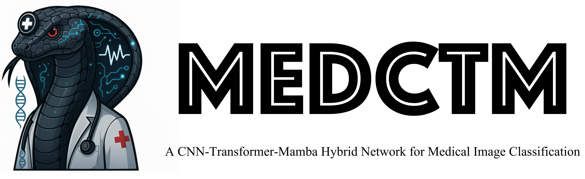
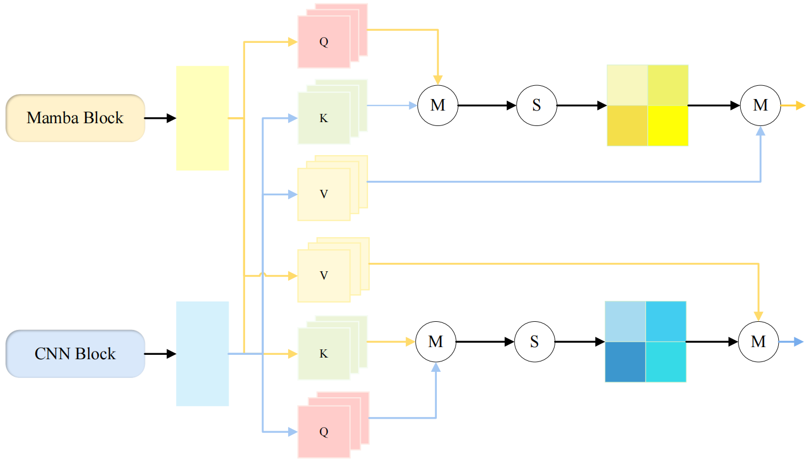
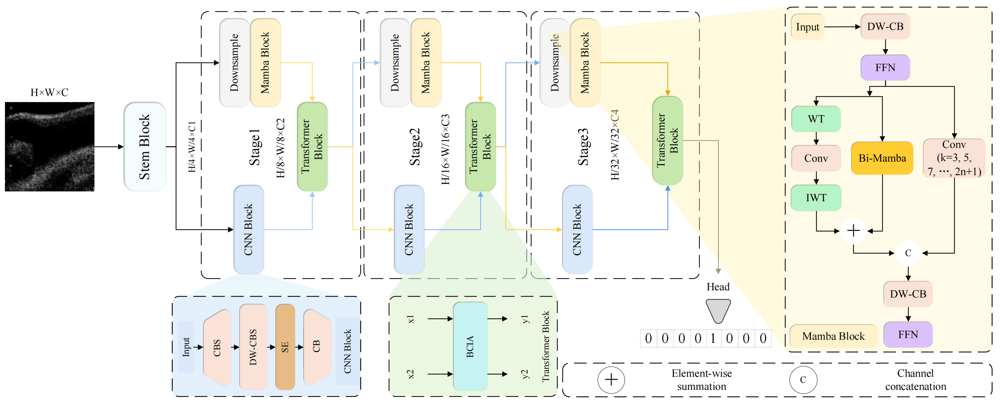
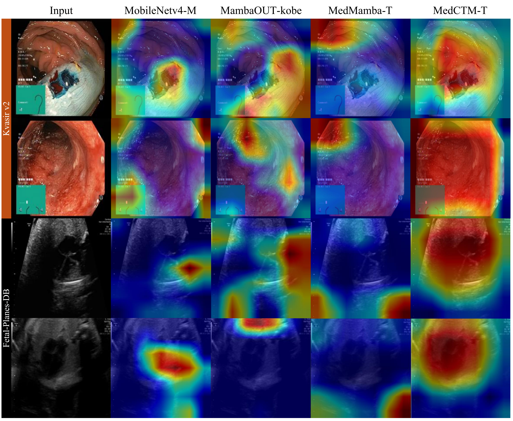
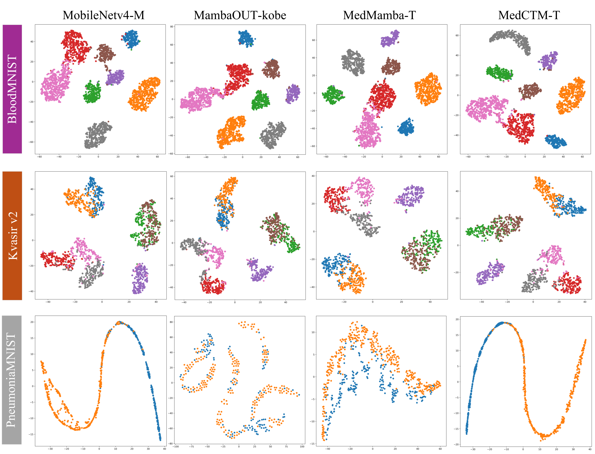

<p align="center">
  
</p>

**🔬 A PyTorch implementation of "MedCTM: A CNN-Transformer-Mamba Hybrid Network for Medical Image Classification"**
[](https://github.com/yourusername/MedCTM#overview)
[](https://github.com/yourusername/MedCTM#architecture)
[](https://github.com/yourusername/MedCTM#installation)
[](https://github.com/yourusername/MedCTM#performance-results)
[](https://github.com/yourusername/MedCTM#quick-start)
[](https://github.com/yourusername/MedCTM#visualization-results)
[](https://github.com/yourusername/MedCTM#applications--extensions)

</div>

---

## 📋 Overview

Medical image classification plays a crucial role in computer-aided diagnosis, yet existing methods face significant challenges in jointly modeling local texture, global dependencies, and long-range contextual relationships. 

**Key Challenges:**
- CNNs lack long-range feature capture capability
- Transformers require extensive labeled data and are computationally expensive
- Existing hybrid architectures suffer from inefficient feature interaction and computational redundancy

**Our Solution:** MedCTM introduces a novel **CNN-Transformer-Mamba ternary collaborative architecture** that synergizes the strengths of all three paradigms.

### 🎯 Key Features

- **🏗️ Convolutional Local Feature Extraction** - Captures fine-grained spatial details
- **🔄 Transformer-based Bidirectional Cross-Attention** - Models global dependencies efficiently  
- **⚡ Mamba for Linear Complexity** - Enables long sequence modeling with reduced computational cost

### 🚀 Main Contributions

1. **Bidirectional Channel Interaction Attention (BCIA)** - Dynamically fuses CNN-captured local details with Mamba-modeled global spatial dependencies
2. **Three-tier Cascade Architecture** - Progressively refines multi-scale features with lightweight design
3. **State-of-the-art Performance** - Comprehensive evaluation on 8 medical datasets demonstrates superior results

---

## 🏗️ Architecture

<div align="center">


*🔄 Bidirectional Channel Interaction Attention Mechanism*


*🏗️ Overall Architecture of MedCTM*

</div>

### 🧩 Component Analysis

| Component | Primary Function | Key Advantage |
|-----------|------------------|---------------|
| **🔲 CNN Module** | Local feature extraction | High-resolution detail capture |
| **🔄 Transformer** | Cross-attention mechanism | Global dependency modeling |
| **⚡ Mamba** | Sequential modeling | Linear computational complexity |

---

## 🛠️ Installation

### Prerequisites

- Python 3.10(ubuntu22.04)
- CUDA 11.8
- PyTorch 2.12

### Step-by-Step Installation

```bash
# Clone the repository
git clone https://github.com/yourusername/MedCTM.git
cd MedCTM

# Create virtual environment (recommended)
python -m venv medctm_env
source medctm_env/bin/activate  # On Windows: medctm_env\Scripts\activate

# Install core dependencies
pip install torch==2.1.2 torchvision==0.16.2 torchaudio
pip install timm==0.9.16 packaging==23.0

# Install Mamba-specific dependencies
pip install triton==2.1.0
pip install causal-conv1d==1.0.1
pip install mamba-ssm==1.0.1

# Install additional utilities
pip install pytest==8.3.5 chardet==4.0.0 yacs==0.1.8 termcolor==2.4.0
pip install scikit-learn==1.3.2 matplotlib==3.7.1
pip install SimpleITK scikit-image PyWavelets==1.4.1
```

---

## 📊 Performance Results

MedCTM achieves state-of-the-art performance across multiple medical imaging benchmarks. Results shown as **Tiny version** / **Large version**.

<div align="center">

| Dataset | Classes | F1-Score (%) | AUC (%) | Kappa (%) |
|:--------|:-------:|:------------:|:-------:|:---------:|
| **[Fetal-Planes-DB](https://zenodo.org/records/3904280)** | 4 | **88.8** / **90.1** | **98.8** / **98.9** | **87.8** / **88.7** |
| **[Kvasir](https://datasets.simula.no/kvasir/)** | 8 | **88.6** / **88.7** | **99.3** / **99.2** | **86.9** / **87.1** |
| **[BloodMNIST](https://medmnist.com/)** | 8 | **98.1** / **98.9** | **99.9** / **100.0** | **98.0** / **98.6** |
| **[DermaMNIST](https://medmnist.com/)** | 7 | **66.4** / **67.2** | **95.9** / **95.4** | **65.3** / **65.8** |
| **[OrganCMNIST](https://medmnist.com/)** | 11 | **89.0** / **89.9** | **99.3** / **99.5** | **87.8** / **89.4** |
| **[OrganSMNIST](https://medmnist.com/)** | 11 | **74.9** / **75.9** | **97.7** / **97.9** | **76.5** / **76.9** |
| **[PneumoniaMNIST](https://medmnist.com/)** | 2 | **92.8** / **95.1** | **99.1** / **98.9** | **85.6** / **90.1** |
| **[RetinaMNIST](https://medmnist.com/)** | 5 | **42.4** / **43.5** | **74.0** / **75.7** | **37.5** / **37.5** |

</div>

> **Note:** Pre-trained model weights will be released soon. Stay tuned for updates!

---

## 🚀 Quick Start

### Training Your Model

```bash
# Basic training command
python train.py \
    --model MedCTM_T \
    --dataset PneumoniaMNIST \
    --epochs 100 \
    --batch_size 32 \
    --lr 0.0001 \
    --save_dir ./checkpoints

# Advanced training with data augmentation
python train.py \
    --model MedCTM_L \
    --dataset Kvasir \
    --epochs 200 \
    --batch_size 16 \
    --lr 0.0001 \
    --augment \
    --scheduler cosine \
    --warmup_epochs 10
```

### Model Evaluation

```bash
# Evaluate single model
python test.py \
    --dataset PneumoniaMNIST \
    --model MedCTM_T \
    --checkpoint ./checkpoints/best_model.pth \
    --batch_size 32

# Compare multiple models
python test.py \
    --dataset PneumoniaMNIST \
    --models MedCTM_T MedCTM_L resnet18 convnext_tiny \
    --weight_dir ./best_models \
    --batch_size 32 \
    --save_results
```
---

## 🔬 Visualization Results

### Attention Heatmaps

<div align="center">


*🔍 Grad-CAM visualization showing model attention on medical images*

</div>

Our visualizations demonstrate that MedCTM effectively focuses on clinically relevant regions, providing interpretable results for medical professionals.

### Feature Space Analysis

<div align="center">


*📊 t-SNE visualization comparing feature representations across different models*

</div>

The t-SNE analysis reveals that MedCTM learns more discriminative feature representations compared to baseline models.

---

## 🔄 Applications & Extensions

MedCTM's flexible architecture enables various medical imaging applications:

### Current Applications
- **Multi-class Medical Image Classification** - Primary focus with demonstrated SOTA results
- **Binary Classification Tasks** - Excellent performance on disease detection tasks
- **Cross-domain Medical Imaging** - Robust performance across different imaging modalities

### Future Extensions
- **🏷️ Multi-label Classification** - For complex diagnostic scenarios with multiple conditions
- **🖼️ Medical Image Segmentation** - Adaptation for pixel-level anatomical structure identification
- **🎯 Medical Object Detection** - Extension for lesion and abnormality localization

---

## 📁 Project Structure

```
MedCTM/
├── assets/                 # Images and documentation assets
├── configs/               # Configuration files
├── data/                  # Dataset loading and preprocessing
├── models/                # Model implementations
│   ├── medctm.py         # Main MedCTM architecture
│   ├── components/       # Individual components (CNN, Transformer, Mamba)
│   └── utils.py          # Model utilities
├── training/             # Training scripts and utilities
├── evaluation/           # Evaluation and testing scripts
├── visualization/        # Visualization tools
├── requirements.txt      # Python dependencies
├── train.py             # Main training script
├── test.py              # Main testing script
└── README.md            # This file
```
---

## 🙏 Acknowledgements

We extend our gratitude to the following projects and researchers:

- **[MedMamba](https://github.com/YubiaoYue/MedMamba)** - Foundation for medical Mamba implementations
- **[MobileFormer](https://github.com/AAboys/MobileFormer)** - Mobile-friendly transformer architectures
- **[MambaOut](https://github.com/yuweihao/MambaOut)** - Mamba architecture optimizations
- **[MobileMamba](https://github.com/lewandofskee/MobileMamba)** - Mobile Mamba implementations
- **[EfficientNetV2](https://github.com/d-li14/efficientnetv2.pytorch)** - Efficient neural network architectures

Special thanks to the medical imaging community for providing high-quality datasets and benchmarks.

---

<div align="center">

**🔬 MedCTM - Advancing Medical Image Classification through Hybrid Architecture Innovation**

Made with ❤️ for the medical AI community

</div>


<div align="center">

</div>
